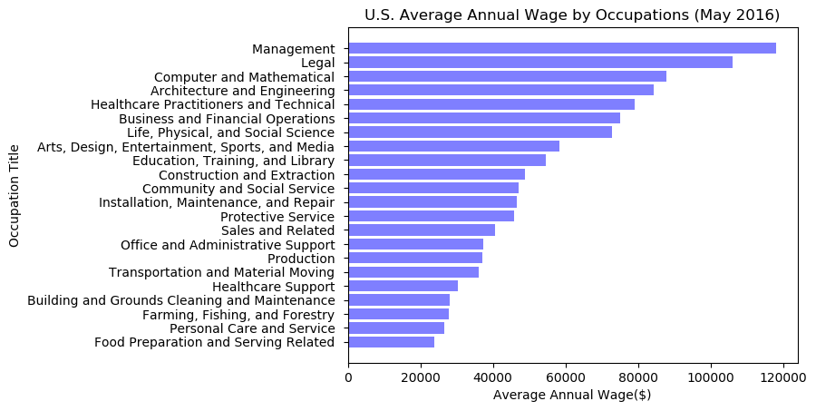
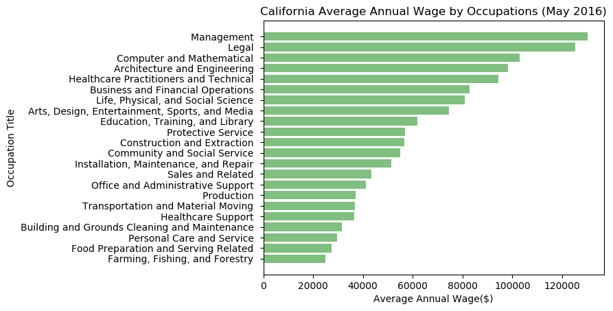
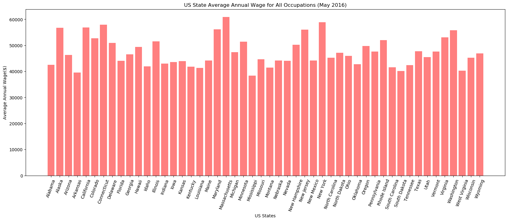
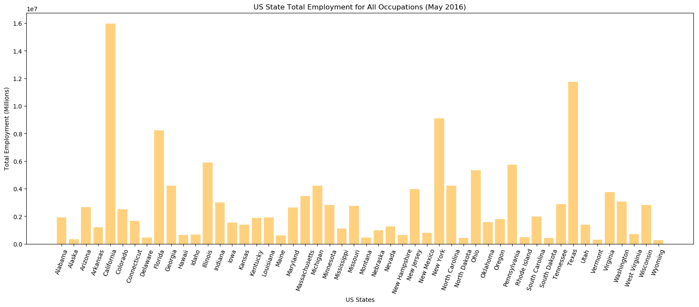

```python
import pandas as pd
import matplotlib.pyplot as plt
import numpy as np
import warnings
warnings.filterwarnings('ignore')
```


```python
bls_df = pd.read_csv("BLSDataset_2016.csv")

us_df = bls_df[bls_df["area_type"] == 1]
us_df.drop(["own_code","annual",'Unnamed: 29', "occ code","hourly", "area_type", "area", "naics", "naics_title"], axis = 1, inplace=True)
us_df.dropna(axis=1, inplace=True)

state_df = bls_df[(bls_df["area_type"] == 2) & (bls_df["area_title"] != "District of Columbia")]
state_df.drop(["own_code","annual",'Unnamed: 29', "occ code","hourly", "area_type", "area", "naics", "naics_title"], axis = 1, inplace=True)
state_df.dropna(axis=1, inplace=True)
```


```python
us_aavg = us_df[us_df["group"] == "major"]
us_aavg.drop_duplicates(["occ title"], keep="first", inplace=True) 
us_aavg[' a_mean '] = us_aavg[' a_mean '].str.replace(',', '')  #remove comma in numbers
us_aavg[' a_mean '] = us_aavg[' a_mean '].astype(int)           #convert string to integers
us_aavg.sort_values(" a_mean ", ascending = False, inplace=True)
us_aavg[["occ title", " a_mean "]].head(10)
```


<div>
<style>
    .dataframe thead tr:only-child th {
        text-align: right;
    }

    .dataframe thead th {
        text-align: left;
    }

    .dataframe tbody tr th {
        vertical-align: top;
    }
</style>
<table border="1" class="dataframe">
  <thead>
    <tr style="text-align: right;">
      <th></th>
      <th>occ title</th>
      <th>a_mean</th>
    </tr>
  </thead>
  <tbody>
    <tr>
      <th>1</th>
      <td>Management Occupations</td>
      <td>118020</td>
    </tr>
    <tr>
      <th>319</th>
      <td>Legal Occupations</td>
      <td>105980</td>
    </tr>
    <tr>
      <th>128</th>
      <td>Computer and Mathematical Occupations</td>
      <td>87880</td>
    </tr>
    <tr>
      <th>161</th>
      <td>Architecture and Engineering Occupations</td>
      <td>84300</td>
    </tr>
    <tr>
      <th>493</th>
      <td>Healthcare Practitioners and Technical Occupat...</td>
      <td>79160</td>
    </tr>
    <tr>
      <th>70</th>
      <td>Business and Financial Operations Occupations</td>
      <td>75070</td>
    </tr>
    <tr>
      <th>221</th>
      <td>Life, Physical, and Social Science Occupations</td>
      <td>72930</td>
    </tr>
    <tr>
      <th>431</th>
      <td>Arts, Design, Entertainment, Sports, and Media...</td>
      <td>58390</td>
    </tr>
    <tr>
      <th>335</th>
      <td>Education, Training, and Library Occupations</td>
      <td>54520</td>
    </tr>
    <tr>
      <th>949</th>
      <td>Construction and Extraction Occupations</td>
      <td>48900</td>
    </tr>
  </tbody>
</table>
</div>


```python
#Total Employment
state_employ = state_df[state_df["group"] == "total"]
state_employ["tot_emp"] = state_employ['tot_emp'].str.replace(',', '')  #remove comma in numbers
state_employ["tot_emp"] = state_employ["tot_emp"].astype(int)  
state_employ.sort_values("tot_emp", ascending=False, inplace=True)
state_employ[["area_title", "tot_emp"]].head(10)
```


<div>
<style>
    .dataframe thead tr:only-child th {
        text-align: right;
    }

    .dataframe thead th {
        text-align: left;
    }

    .dataframe tbody tr th {
        vertical-align: top;
    }
</style>
<table border="1" class="dataframe">
  <thead>
    <tr style="text-align: right;">
      <th></th>
      <th>area_title</th>
      <th>tot_emp</th>
    </tr>
  </thead>
  <tbody>
    <tr>
      <th>184563</th>
      <td>California</td>
      <td>15966580</td>
    </tr>
    <tr>
      <th>184602</th>
      <td>Texas</td>
      <td>11745250</td>
    </tr>
    <tr>
      <th>184591</th>
      <td>New York</td>
      <td>9097650</td>
    </tr>
    <tr>
      <th>184568</th>
      <td>Florida</td>
      <td>8222030</td>
    </tr>
    <tr>
      <th>184572</th>
      <td>Illinois</td>
      <td>5903820</td>
    </tr>
    <tr>
      <th>184597</th>
      <td>Pennsylvania</td>
      <td>5747020</td>
    </tr>
    <tr>
      <th>184594</th>
      <td>Ohio</td>
      <td>5337890</td>
    </tr>
    <tr>
      <th>184592</th>
      <td>North Carolina</td>
      <td>4231020</td>
    </tr>
    <tr>
      <th>184569</th>
      <td>Georgia</td>
      <td>4214410</td>
    </tr>
    <tr>
      <th>184581</th>
      <td>Michigan</td>
      <td>4212090</td>
    </tr>
  </tbody>
</table>
</div>


```python
#State Average Annual Income
state_aavg = state_df[state_df["group"] == "total"]
state_aavg[" a_mean "] = state_aavg[' a_mean '].str.replace(',', '')  #remove comma in numbers
state_aavg[" a_mean "] = state_aavg[" a_mean "].astype(int)     
state_aavg.sort_values(" a_mean ", ascending=False, inplace=True)
state_aavg[["area_title", " a_mean "]].head(10)
```


<div>
<style>
    .dataframe thead tr:only-child th {
        text-align: right;
    }

    .dataframe thead th {
        text-align: left;
    }

    .dataframe tbody tr th {
        vertical-align: top;
    }
</style>
<table border="1" class="dataframe">
  <thead>
    <tr style="text-align: right;">
      <th></th>
      <th>area_title</th>
      <th>a_mean</th>
    </tr>
  </thead>
  <tbody>
    <tr>
      <th>184580</th>
      <td>Massachusetts</td>
      <td>60840</td>
    </tr>
    <tr>
      <th>184591</th>
      <td>New York</td>
      <td>58910</td>
    </tr>
    <tr>
      <th>184565</th>
      <td>Connecticut</td>
      <td>57960</td>
    </tr>
    <tr>
      <th>184563</th>
      <td>California</td>
      <td>56840</td>
    </tr>
    <tr>
      <th>184560</th>
      <td>Alaska</td>
      <td>56710</td>
    </tr>
    <tr>
      <th>184579</th>
      <td>Maryland</td>
      <td>56120</td>
    </tr>
    <tr>
      <th>184589</th>
      <td>New Jersey</td>
      <td>56030</td>
    </tr>
    <tr>
      <th>184606</th>
      <td>Washington</td>
      <td>55810</td>
    </tr>
    <tr>
      <th>184605</th>
      <td>Virginia</td>
      <td>53090</td>
    </tr>
    <tr>
      <th>184564</th>
      <td>Colorado</td>
      <td>52710</td>
    </tr>
  </tbody>
</table>
</div>


```python
#California Occupation with the highest average annual income
cali_df = state_df[(state_df["area_title"] == "California") & (state_df["group"] == "major")] 
cali_df[' a_mean '] = cali_df[' a_mean '].str.replace(',', '') 
cali_df = cali_df[cali_df[' a_mean '] != "*"]                  # remove N/A observations
cali_df[' a_mean '] = cali_df[' a_mean '].astype(int)          
cali_df.sort_values(" a_mean ", ascending=False, inplace=True)
cali_df[["occ title", " a_mean "]].head(10)
```


<div>
<style>
    .dataframe thead tr:only-child th {
        text-align: right;
    }

    .dataframe thead th {
        text-align: left;
    }

    .dataframe tbody tr th {
        vertical-align: top;
    }
</style>
<table border="1" class="dataframe">
  <thead>
    <tr style="text-align: right;">
      <th></th>
      <th>occ title</th>
      <th>a_mean</th>
    </tr>
  </thead>
  <tbody>
    <tr>
      <th>184614</th>
      <td>Management Occupations</td>
      <td>130200</td>
    </tr>
    <tr>
      <th>192940</th>
      <td>Legal Occupations</td>
      <td>125150</td>
    </tr>
    <tr>
      <th>187893</th>
      <td>Computer and Mathematical Occupations</td>
      <td>102970</td>
    </tr>
    <tr>
      <th>188761</th>
      <td>Architecture and Engineering Occupations</td>
      <td>98370</td>
    </tr>
    <tr>
      <th>198039</th>
      <td>Healthcare Practitioners and Technical Occupat...</td>
      <td>94480</td>
    </tr>
    <tr>
      <th>186316</th>
      <td>Business and Financial Operations Occupations</td>
      <td>82910</td>
    </tr>
    <tr>
      <th>190316</th>
      <td>Life, Physical, and Social Science Occupations</td>
      <td>80960</td>
    </tr>
    <tr>
      <th>196296</th>
      <td>Arts, Design, Entertainment, Sports, and Media...</td>
      <td>74610</td>
    </tr>
    <tr>
      <th>193398</th>
      <td>Education, Training, and Library Occupations</td>
      <td>61890</td>
    </tr>
    <tr>
      <th>201825</th>
      <td>Protective Service Occupations</td>
      <td>56810</td>
    </tr>
  </tbody>
</table>
</div>


```python
fig, ax = plt.subplots()

# Example data
y_pos = np.arange(len(us_aavg[' a_mean ']))
yticks = us_aavg['occ title'].str.replace('Occupations', '')

ax.barh(y_pos, us_aavg[' a_mean '], color = "blue", alpha = .5)
ax.set_yticks(y_pos)
ax.set_yticklabels(yticks)
ax.invert_yaxis()  # labels read top-to-bottom
ax.set_xlabel('Average Annual Wage($)')
ax.set_ylabel('Occupation Title')
ax.set_title('U.S. Average Annual Wage by Occupations (May 2016)')

plt.show()
```





```python
fig, ax = plt.subplots()

# Example data
y_pos = np.arange(len(cali_df[' a_mean ']))
yticks = cali_df['occ title'].str.replace('Occupations', '')
ax.barh(y_pos, cali_df[' a_mean '],color = 'green', alpha = .5)
ax.set_yticks(y_pos)
ax.set_yticklabels(yticks)
ax.invert_yaxis()  # labels read top-to-bottom
ax.set_xlabel('Average Annual Wage($)')
ax.set_ylabel('Occupation Title')
ax.set_title('California Average Annual Wage by Occupations (May 2016)')

plt.show()
```





```python
x = np.arange(50)
plt.figure(figsize=(20, 7))
plt.bar(x, state_aavg[" a_mean "], color = "red", alpha = .5)
plt.xlabel("US States")
plt.ylabel("Average Annual Wage($)")
plt.title("US State Average Annual Wage for All Occupations (May 2016)")
plt.xticks(x, state_aavg["area_title"], rotation = 70)
plt.show()
```





```python
plt.figure(figsize=(20, 7))
plt.bar(x, state_employ["tot_emp"], color ="orange", alpha = .5)
plt.xlabel("US States")
plt.ylabel("Total Employment (Millions)")
plt.title("US State Total Employment for All Occupations (May 2016)")
plt.xticks(x, state_employ["area_title"], rotation = 70)
plt.show()
```




